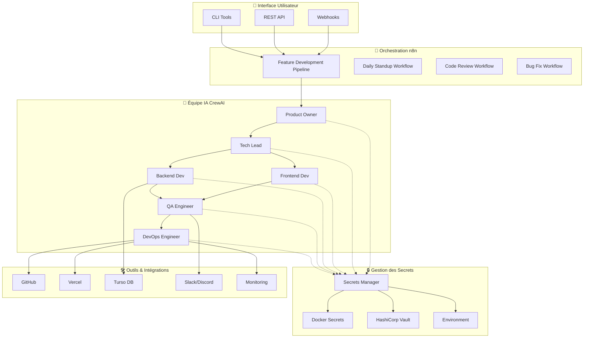
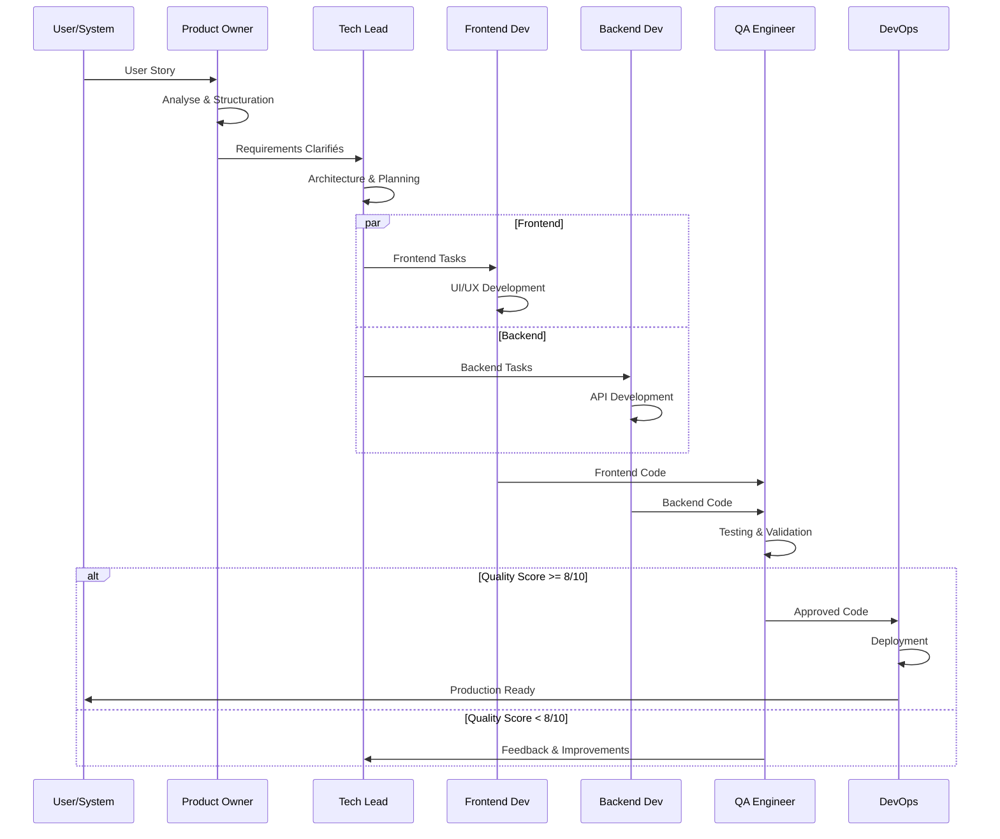

# 🚀 EasyRSVP AI Team - Documentation Complète

> **Système d'orchestration d'équipe IA pour le développement automatisé de fonctionnalités EasyRSVP**

[](CHANGELOG.md)
[](../LICENSE)
[](https://python.org)
[](https://n8n.io)

## 📋 Table des Matières

### 🎯 [Vue d'Ensemble](#vue-densemble)
- [Qu'est-ce qu'EasyRSVP AI Team ?](#quest-ce-queasyRSVP-ai-team)
- [Architecture Générale](#architecture-générale)
- [Fonctionnalités Principales](#fonctionnalités-principales)

### 🚀 [Installation & Configuration](#installation--configuration)
- [Prérequis](#prérequis)
- [Installation Rapide](#installation-rapide)
- [Configuration Avancée](#configuration-avancée)

### 👥 [Équipe IA](#équipe-ia)
- [Agents CrewAI](#agents-crewai)
- [Workflows de Développement](#workflows-de-développement)
- [Pipeline de Qualité](#pipeline-de-qualité)

### 🔧 [Guides Techniques](#guides-techniques)
- [API & Intégrations](#api--intégrations)
- [Sécurité & Secrets](#sécurité--secrets)
- [Monitoring & Observabilité](#monitoring--observabilité)

### 📖 [Guides d'Usage](#guides-dusage)
- [Développement de Fonctionnalités](#développement-de-fonctionnalités)
- [Gestion des Workflows](#gestion-des-workflows)
- [Débogage & Troubleshooting](#débogage--troubleshooting)

### 🔗 [Références](#références)
- [API Reference](#api-reference)
- [Configuration Reference](#configuration-reference)
- [Changelog](#changelog)

---

## 🎯 Vue d'Ensemble

### Qu'est-ce qu'EasyRSVP AI Team ?

EasyRSVP AI Team est un système d'orchestration intelligent qui automatise le développement de fonctionnalités pour la plateforme EasyRSVP. Il utilise une équipe de 6 agents IA spécialisés qui collaborent pour transformer des user stories en code de production déployé.

#### 🏗️ Architecture Générale



### 🎯 Fonctionnalités Principales

#### ✨ Développement Automatisé
- **Pipeline Complet** : De l'user story au déploiement en production
- **Équipe IA Spécialisée** : 6 agents avec des rôles bien définis
- **Qualité Assurée** : Gates de qualité avec scores minimum requis
- **Standards Respectés** : TypeScript, Tailwind CSS v4, Next.js 15

#### 🔄 Workflows Intelligents
- **Feature Development** : Pipeline principal de développement
- **Daily Standup** : Rapports automatiques de progression
- **Code Review** : Analyse et validation automatique
- **Bug Fixing** : Détection et correction proactive

#### 🔐 Sécurité Intégrée
- **Multi-Backend Secrets** : Docker Secrets, Vault, Environment
- **Rotation Automatique** : Gestion des clés API
- **Audit Complet** : Traçabilité des accès
- **Configuration Sécurisée** : Chiffrement et isolation

#### 📊 Monitoring & Observabilité
- **Métriques en Temps Réel** : Vélocité, qualité, cycle time
- **Alertes Intelligentes** : Notifications contextuelles
- **Dashboards** : Visualisation des performances
- **Logs Centralisés** : Debugging facilité

---

## 🚀 Installation & Configuration

### Prérequis

- **Docker & Docker Compose** (v24.0+)
- **Node.js** (v18+) et **npm**
- **Python** (v3.11+)
- **Git** (v2.30+)
- **n8n** (dernière version)

### Installation Rapide

```bash
# 1. Cloner le repository
git clone <your-repo-url>
cd team-ai

# 2. Configurer l'environnement
cp env.example .env
# ✏️ Éditer .env avec vos API keys

# 3. Installer les dépendances
npm install
pip install -r requirements.txt

# 4. Démarrer avec Docker Compose
docker-compose up -d

# 5. Vérifier l'installation
curl http://localhost:3000/health
```

### Configuration Avancée

Voir les guides détaillés :
- 📖 [Guide d'Installation Détaillé](installation-guide.md)
- 🔧 [Configuration des Agents](agent-configuration.md)
- 🔐 [Configuration Sécurisée](security-configuration.md)
- 🌐 [Configuration n8n](n8n-setup.md)

---

## 👥 Équipe IA

### Agents CrewAI

Notre équipe IA est composée de 6 agents spécialisés :

#### 🎯 **Product Owner** - Sarah Chen
- **Rôle** : Analyse et structuration des requirements
- **Expertise** : UX/UI, Business analysis, User stories
- **Responsabilités** : Clarification des besoins, priorisation, acceptance criteria

#### 🏗️ **Tech Lead** - Marcus Rodriguez  
- **Rôle** : Architecture et coordination technique
- **Expertise** : System design, Code review, Team coordination
- **Responsabilités** : Architecture decisions, task delegation, code standards

#### 🎨 **Frontend Developer** - Amélie Dubois
- **Rôle** : Développement interface utilisateur
- **Expertise** : Next.js 15, TypeScript, Tailwind CSS v4, React
- **Responsabilités** : UI/UX implementation, responsive design, accessibility

#### ⚙️ **Backend Developer** - Raj Patel
- **Rôle** : Développement API et logique métier
- **Expertise** : Node.js, TypeScript, Database design, API development
- **Responsabilités** : Backend logic, database design, API endpoints

#### 🧪 **QA Engineer** - Elena Kowalski
- **Rôle** : Assurance qualité et testing
- **Expertise** : Testing strategies, Automation, Performance testing
- **Responsabilités** : Test planning, quality validation, bug detection

#### 🚀 **DevOps Engineer** - Ahmed Hassan
- **Rôle** : Déploiement et infrastructure
- **Expertise** : CI/CD, Vercel, Monitoring, Security
- **Responsabilités** : Deployment, monitoring, infrastructure, security

### Workflows de Développement

#### 🔄 Pipeline Principal (Feature Development)



#### ⏰ Daily Standup Automatique

- **Fréquence** : Tous les jours à 9h00
- **Contenu** : 
  - Progression des tâches en cours
  - Blocages identifiés
  - Objectifs de la journée
  - Métriques de performance
- **Distribution** : Slack, Discord, Email

#### 🔍 Code Review Automatique

- **Trigger** : Push sur les branches
- **Processus** :
  - Analyse automatique du code
  - Vérification des standards
  - Tests de sécurité
  - Performance check
- **Validation** : Score minimum requis

---

## 🔧 Guides Techniques

### 📚 Documentation Détaillée

| Guide | Description | Niveau |
|-------|-------------|---------|
| 🏗️ [Architecture Guide](architecture-guide.md) | Architecture complète du système | Avancé |
| 🔧 [API Reference](api-reference.md) | Documentation complète de l'API | Intermédiaire |
| 🔐 [Security Guide](security-usage-guide.md) | Sécurité et gestion des secrets | Avancé |
| 🌐 [n8n Workflows](n8n-workflows.md) | Configuration des workflows | Intermédiaire |
| 📊 [Monitoring Guide](monitoring-guide.md) | Observabilité et métriques | Intermédiaire |
| 🐛 [Troubleshooting](troubleshooting.md) | Résolution des problèmes | Débutant |
| 🚀 [Deployment Guide](deployment-guide.md) | Déploiement en production | Avancé |

### 🔗 Intégrations Principales

- **GitHub** : Gestion du code source et CI/CD
- **Vercel** : Déploiement automatique
- **Turso** : Base de données SQLite distribuée
- **Slack/Discord** : Notifications et communication
- **Sentry** : Monitoring et error tracking

---

## 📖 Guides d'Usage

### 🎯 Développement de Fonctionnalités

#### 1. **Création d'une User Story**

```bash
# Via API
curl -X POST http://localhost:3000/api/crew/feature-development \
  -H "Content-Type: application/json" \
  -d '{
    "user_story": "En tant qu'utilisateur, je veux pouvoir filtrer les événements par catégorie pour trouver plus facilement ce qui m'intéresse",
    "priority": "high",
    "deadline": "2024-01-15"
  }'

# Via n8n Webhook
# Configuré automatiquement avec les workflows
```

#### 2. **Suivi de Progression**

```bash
# Statut global
curl http://localhost:3000/api/tasks/status

# Détails d'une tâche
curl http://localhost:3000/api/tasks/{task_id}

# Métriques de l'équipe
curl http://localhost:3000/api/metrics/team
```

#### 3. **Validation Qualité**

Les gates de qualité incluent :
- ✅ **Code Quality** : Linting, formatting, complexity
- ✅ **Security** : Vulnerability scanning, OWASP compliance
- ✅ **Performance** : Load testing, optimization
- ✅ **Accessibility** : WCAG AA compliance
- ✅ **Testing** : Unit, integration, e2e coverage

---

## 🔗 Références

### 📋 Quick Reference

| Commande | Description |
|----------|-------------|
| `docker-compose up -d` | Démarrer tous les services |
| `npm run dev` | Mode développement |
| `python -m agents.api` | Démarrer l'API agents |
| `curl localhost:3000/health` | Health check |

### 🌐 Liens Utiles

- 🏠 [Site Principal EasyRSVP](https://easyRSVP.com)
- 📖 [Documentation n8n](https://docs.n8n.io)
- 🤖 [CrewAI Documentation](https://docs.crewai.com)
- 🐳 [Docker Documentation](https://docs.docker.com)

### 🆘 Support

- 📧 **Email** : support@easyRSVP.com
- 💬 **Discord** : [EasyRSVP Community](discord-link)
- 📱 **Slack** : #ai-team-support
- 🐛 **Issues** : [GitHub Issues](github-issues-link)

---

## 🎉 Conclusion

EasyRSVP AI Team représente l'avenir du développement automatisé. Avec cette équipe IA, vous pouvez :

- ⚡ **Développer 10x plus vite** avec l'automation intelligente
- 🎯 **Maintenir une qualité élevée** avec les gates automatiques
- 🔐 **Assurer la sécurité** avec la gestion centralisée des secrets
- 📊 **Optimiser en continu** avec le monitoring avancé

**Prêt à transformer votre développement ?** 🚀

[📖 Commencer avec le Guide d'Installation](installation-guide.md) | [🎯 Créer votre première Feature](feature-development-guide.md)

---

<div align="center">

**🌟 EasyRSVP AI Team - Développement Intelligent pour l'Avenir 🌟**

*Made with ❤️ by the EasyRSVP Team*

</div> 